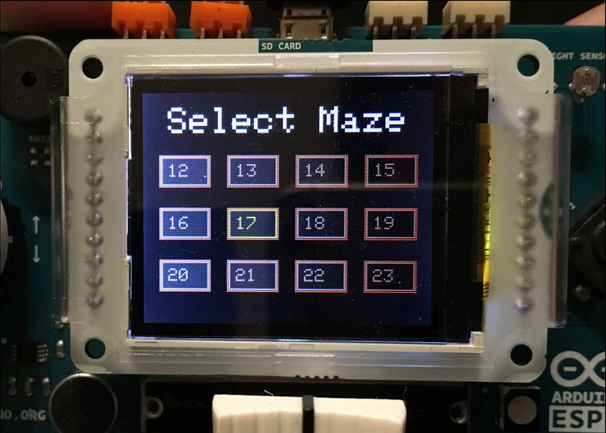
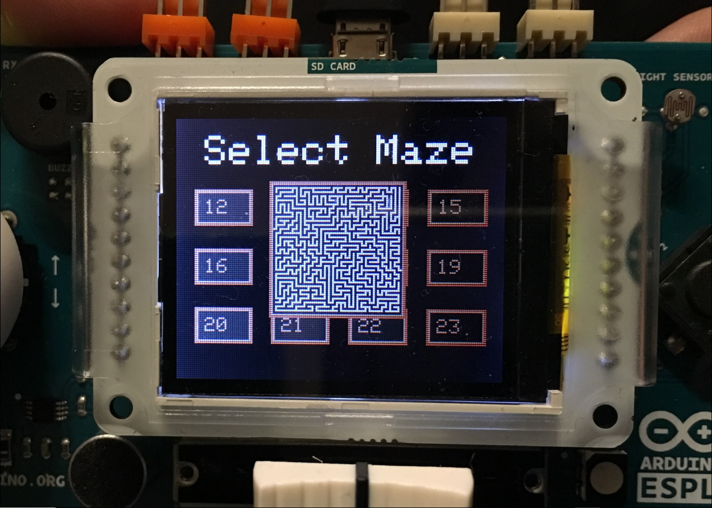
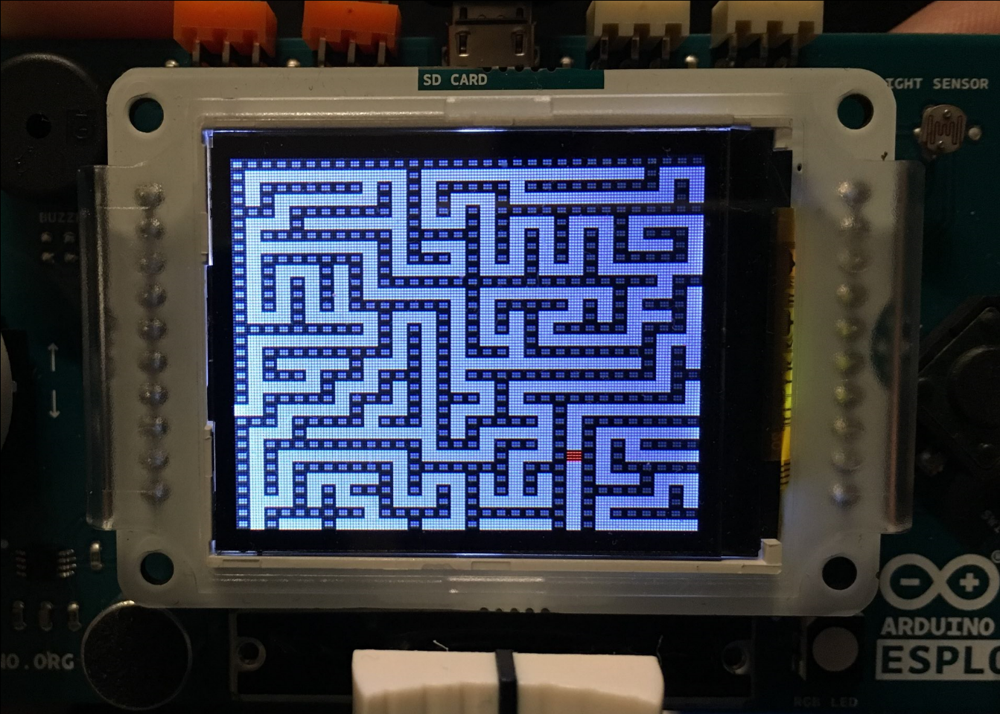
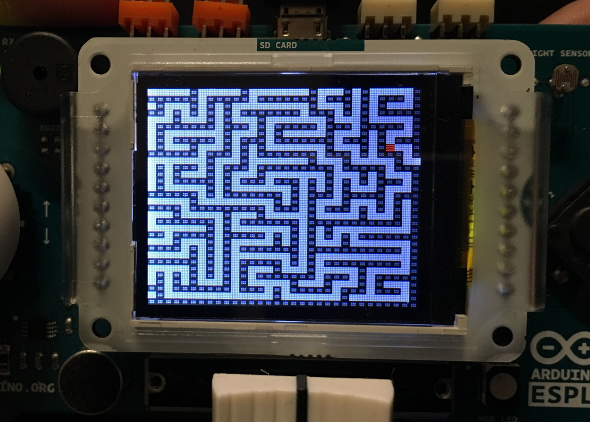
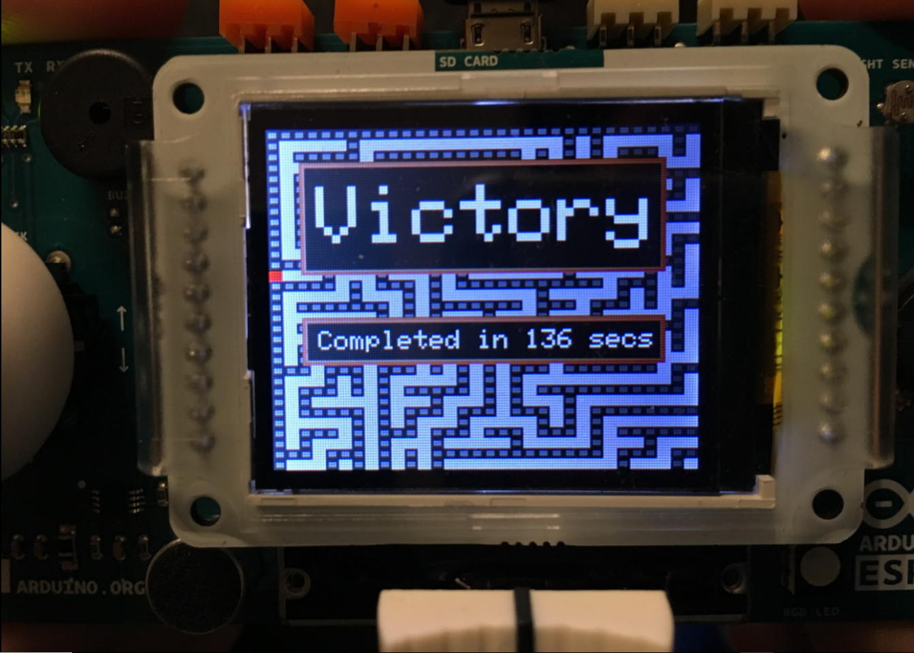

# Arduino Esplora Maze Runner Game

[Arduino Project Hub Page]()

## Introduction

This project is a Maze game for Arduino. I developed the code specifically for the Arduino Esplora, but can be deployed in any Arduino by replacing the Esplora and EsporaTFT libraries by purer code.
The mazes are character sequences of 't's (path) and 'f's (wall), which form a grid. The maze size is 64x64, and is displayed in 4 quadrants of 32x32 tiles. When the player reaches the edge of the quadrant, the game renders the next quadrant.

Maze file format:

```
<int>;<int>;<int>;<int>!<char[1024]!<char[1024]!<char[1024]!<char[1024]
```

Which translates to:

```
entryRow, entryCol, exitRow, exitCol, quadrant0, quadrant1, quadrant2, quadrant3
```

The quadrants are displayed as:

```
0000 ... 1111
0000 ... 1111
0000 ... 1111
....     ....
2222 ... 3333
2222 ... 3333
2222 ... 3333
```

The edge of the 64x64 maze should be made of walls ('f') except for both entrance and exit.
There should be two, and only two path blocks on the edge of the maze, which will be the Entry and Exit of the maze.
It is possible to load an infinite number of maze files (I provide a zip file with a few randomly generated mazes).

## Hardware

The only hardware used in this project were:
* Arduino Esplora: https://store.arduino.cc/arduino-esplora

* Ardiono LCD Screen: https://store.arduino.cc/arduino-lcd-screen
* Micro SD card

## Installation

1. Unzip the maze file pack in the root of the micro SD card
2. Compile the Sketch with the Arduino IDE and upload it to your Arduino Esplora.

## Usage

### Maze selection



* **Joystick** - Browse / Select a maze.
* **Top button** - Preview the maze.
* **Bottom button** - Start the maze.

### Maze game



* **Joystick** - Move through the maze.
* **Top button** - Preview the whole maze.
* **Right button** - Cancels the maze and go back to selection screen.

### Victory screen



* **Bottom button** - Dismiss and go back to the maze selection screen.

## Feedback?

I appreciate feedback of any kind. Just give a message or post in issues. Thanks!
